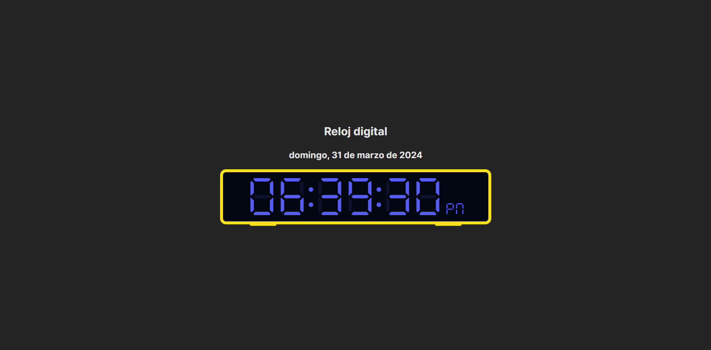

# Práctica 1 - Ejercicio 1

Selecciona un elemento del DOM y cambia su contenido.

## Reloj Digital

El reloj digital toma en cuenta la hora actual y va cambiando a cada segundo para mantenerse actualizado.

### Recursos

[Preview](https://practice-one-digital-clock.netlify.app/)
